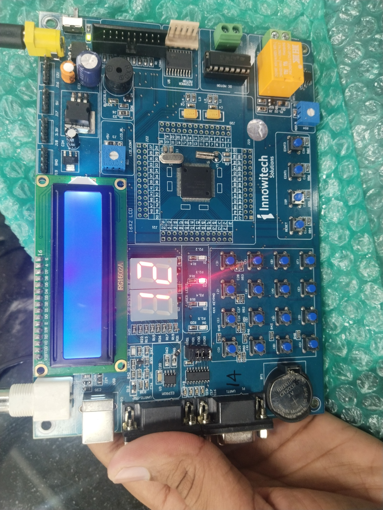
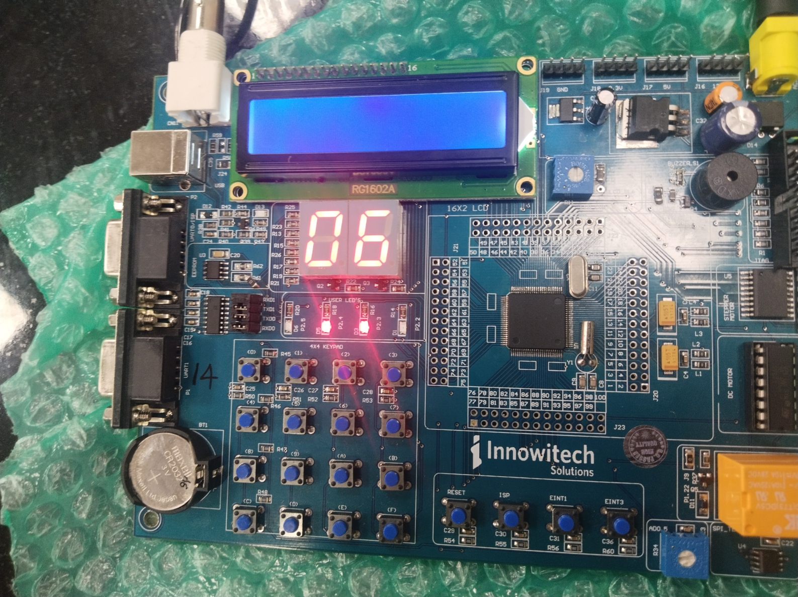
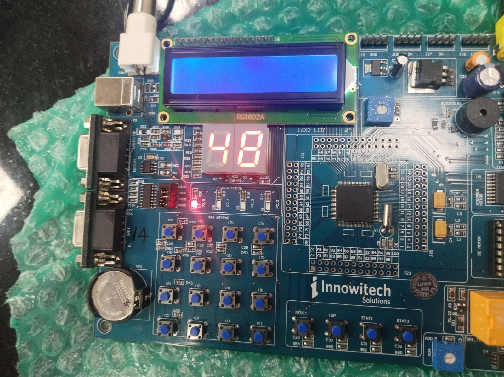
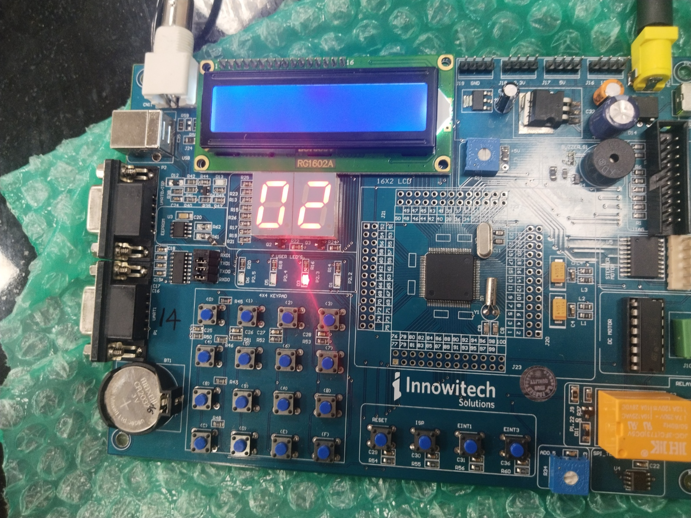

# Binary Calculator using LPC1768 Microcontroller

 # Project Overview

This project implements a Binary Calculator using the LPC1768 ARM Cortex-M3 Microcontroller. The calculator performs basic arithmetic operations on predefined test cases and displays the results using LEDs and a multiplexed 7-segment display.

The project was developed using **Embedded C** and demonstrates GPIO programming, interrupt handling, LED interfacing, 7-segment display multiplexing, and buzzer control.


# Features

- Addition
- Subtraction
- Multiplication
- Division
- External Interrupt (EINT1) to switch between test cases
- Result displayed on:
  - LEDs (Lower 4 bits)
  - Two-digit 7-Segment Display
- Buzzer support
- Multiple predefined test cases


# Hardware Used

- LPC1768 Microcontroller
- ARM Cortex-M3 Development Board
- 2-Digit Seven Segment Display
- LEDs
- Push Button (EINT1)
- Buzzer
- Connecting Wires
- Power Supply


# 💻 Software Used

- Embedded C
- Keil uVision IDE
- LPC17xx CMSIS Library

---

## 📂 Project Structure

```
Binary-Calculator-using-LPC1768-Microcontroller/

│── Embedded C code/
│     └── main.c
│
│── RESULTS/
│     ├── Arithmetic Operations.png
│     ├── IMG_20260423_171640.jpg
│     ├── IMG_20260423_171654.jpg
│     ├── IMG_20260423_171657.jpg
│     └── IMG_20260423_171700.jpg
│
└── README.md
```

---

# Working

1. The program loads predefined values for A and B.
2. Arithmetic operations are performed one after another:
   - Addition
   - Subtraction
   - Multiplication
   - Division
3. The result is shown on:
   - Two-digit 7-segment display
   - LEDs
4. Pressing the **EINT1 Push Button** changes to the next test case.

---

# Project Results

### Arithmetic Operations


# Hardware Output









---

# Author

**Hitesh Reddy Emani**

GitHub:
https://github.com/hiteshreddyemani-create


## 📄 License

This project is developed for educational purposes.
